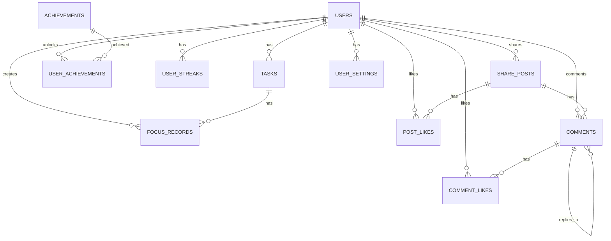

# DeepFocus 深度专注应用数据表设计

## 1. 数据库概述

DeepFocus应用采用关系型数据库设计，用于存储用户信息、任务、专注记录、成就、分享帖子、评论等数据。本设计基于MySQL数据库，遵循关系型数据库设计规范，确保数据的完整性和一致性。

## 2. 数据库设计原则

- 范式化设计，减少数据冗余
- 合理的索引设计，提高查询性能
- 外键约束，确保数据完整性
- 适当的字段类型选择，优化存储效率
- 支持扩展，适应未来需求变化

## 3. 数据表设计

### 3.1 用户表（users）

存储用户的基本信息。

| 字段名 | 数据类型 | 长度 | 约束 | 描述 |
| --- | --- | --- | --- | --- |
| `id` | `VARCHAR` | 36 | `PRIMARY KEY` | 用户ID，使用UUID |
| `username` | `VARCHAR` | 50 | `UNIQUE NOT NULL` | 用户名 |
| `email` | `VARCHAR` | 100 | `UNIQUE NOT NULL` | 邮箱 |
| `password_hash` | `VARCHAR` | 255 | `NOT NULL` | 密码哈希值 |
| `avatar` | `VARCHAR` | 255 | | 用户头像URL |
| `bio` | `TEXT` | | | 用户简介 |
| `created_at` | `DATETIME` | | `NOT NULL DEFAULT CURRENT_TIMESTAMP` | 创建时间 |
| `updated_at` | `DATETIME` | | `NOT NULL DEFAULT CURRENT_TIMESTAMP ON UPDATE CURRENT_TIMESTAMP` | 更新时间 |
| `last_login` | `DATETIME` | | | 最后登录时间 |
| `is_active` | `TINYINT` | 1 | `NOT NULL DEFAULT 1` | 是否激活 |

**索引设计：**
- `idx_email`：唯一索引，加速邮箱查询
- `idx_username`：唯一索引，加速用户名查询

### 3.2 任务表（tasks）

存储用户创建的任务信息。

| 字段名 | 数据类型 | 长度 | 约束 | 描述 |
| --- | --- | --- | --- | --- |
| `id` | `BIGINT` | | `PRIMARY KEY AUTO_INCREMENT` | 任务ID |
| `user_id` | `VARCHAR` | 36 | `NOT NULL REFERENCES users(id) ON DELETE CASCADE` | 用户ID |
| `name` | `VARCHAR` | 100 | `NOT NULL` | 任务名称 |
| `description` | `TEXT` | | | 任务描述 |
| `is_default` | `TINYINT` | 1 | `NOT NULL DEFAULT 0` | 是否默认任务 |
| `created_at` | `DATETIME` | | `NOT NULL DEFAULT CURRENT_TIMESTAMP` | 创建时间 |
| `updated_at` | `DATETIME` | | `NOT NULL DEFAULT CURRENT_TIMESTAMP ON UPDATE CURRENT_TIMESTAMP` | 更新时间 |

**索引设计：**
- `idx_user_id`：普通索引，加速用户任务查询

### 3.3 专注记录表（focus_records）

存储用户的专注记录信息。

| 字段名 | 数据类型 | 长度 | 约束 | 描述 |
| --- | --- | --- | --- | --- |
| `id` | `BIGINT` | | `PRIMARY KEY AUTO_INCREMENT` | 记录ID |
| `user_id` | `VARCHAR` | 36 | `NOT NULL REFERENCES users(id) ON DELETE CASCADE` | 用户ID |
| `task_id` | `BIGINT` | | `NOT NULL REFERENCES tasks(id) ON DELETE CASCADE` | 任务ID |
| `task_name` | `VARCHAR` | 100 | `NOT NULL` | 任务名称（冗余字段，避免联表查询） |
| `duration` | `INT` | | `NOT NULL` | 专注时长（秒） |
| `type` | `ENUM('focus', 'short-break', 'long-break')` | | `NOT NULL DEFAULT 'focus'` | 记录类型 |
| `date` | `DATETIME` | | `NOT NULL DEFAULT CURRENT_TIMESTAMP` | 记录日期时间 |
| `created_at` | `DATETIME` | | `NOT NULL DEFAULT CURRENT_TIMESTAMP` | 创建时间 |

**索引设计：**
- `idx_user_id`：普通索引，加速用户记录查询
- `idx_task_id`：普通索引，加速任务记录查询
- `idx_date`：普通索引，加速日期范围查询
- `idx_type`：普通索引，加速类型查询

### 3.4 成就表（achievements）

存储系统预设的成就信息。

| 字段名 | 数据类型 | 长度 | 约束 | 描述 |
| --- | --- | --- | --- | --- |
| `id` | `VARCHAR` | 50 | `PRIMARY KEY` | 成就ID |
| `name` | `VARCHAR` | 100 | `NOT NULL` | 成就名称 |
| `description` | `TEXT` | | `NOT NULL` | 成就描述 |
| `type` | `ENUM('consecutive', 'total')` | | `NOT NULL` | 成就类型 |
| `target` | `INT` | | `NOT NULL` | 目标值 |
| `icon` | `VARCHAR` | 255 | | 成就图标URL |
| `created_at` | `DATETIME` | | `NOT NULL DEFAULT CURRENT_TIMESTAMP` | 创建时间 |
| `updated_at` | `DATETIME` | | `NOT NULL DEFAULT CURRENT_TIMESTAMP ON UPDATE CURRENT_TIMESTAMP` | 更新时间 |

### 3.5 用户成就表（user_achievements）

存储用户解锁的成就信息。

| 字段名 | 数据类型 | 长度 | 约束 | 描述 |
| --- | --- | --- | --- | --- |
| `id` | `BIGINT` | | `PRIMARY KEY AUTO_INCREMENT` | 记录ID |
| `user_id` | `VARCHAR` | 36 | `NOT NULL REFERENCES users(id) ON DELETE CASCADE` | 用户ID |
| `achievement_id` | `VARCHAR` | 50 | `NOT NULL REFERENCES achievements(id) ON DELETE CASCADE` | 成就ID |
| `unlocked` | `TINYINT` | 1 | `NOT NULL DEFAULT 0` | 是否已解锁 |
| `unlock_date` | `DATETIME` | | | 解锁时间 |
| `progress` | `INT` | | `NOT NULL DEFAULT 0` | 当前进度 |
| `created_at` | `DATETIME` | | `NOT NULL DEFAULT CURRENT_TIMESTAMP` | 创建时间 |
| `updated_at` | `DATETIME` | | `NOT NULL DEFAULT CURRENT_TIMESTAMP ON UPDATE CURRENT_TIMESTAMP` | 更新时间 |

**索引设计：**
- `idx_user_id`：普通索引，加速用户成就查询
- `idx_achievement_id`：普通索引，加速成就查询
- `idx_user_achievement`：唯一索引，确保用户每个成就只有一条记录

### 3.6 用户连续打卡表（user_streaks）

存储用户的连续打卡信息。

| 字段名 | 数据类型 | 长度 | 约束 | 描述 |
| --- | --- | --- | --- | --- |
| `id` | `BIGINT` | | `PRIMARY KEY AUTO_INCREMENT` | 记录ID |
| `user_id` | `VARCHAR` | 36 | `NOT NULL REFERENCES users(id) ON DELETE CASCADE` | 用户ID |
| `consecutive_days` | `INT` | | `NOT NULL DEFAULT 0` | 连续打卡天数 |
| `last_focus_date` | `DATE` | | | 最后专注日期 |
| `updated_at` | `DATETIME` | | `NOT NULL DEFAULT CURRENT_TIMESTAMP ON UPDATE CURRENT_TIMESTAMP` | 更新时间 |

**索引设计：**
- `idx_user_id`：唯一索引，确保每个用户只有一条记录

### 3.7 分享帖子表（share_posts）

存储用户分享的帖子信息。

| 字段名 | 数据类型 | 长度 | 约束 | 描述 |
| --- | --- | --- | --- | --- |
| `id` | `VARCHAR` | 36 | `PRIMARY KEY` | 帖子ID |
| `user_id` | `VARCHAR` | 36 | `NOT NULL REFERENCES users(id) ON DELETE CASCADE` | 用户ID |
| `content` | `TEXT` | | `NOT NULL` | 帖子内容 |
| `duration` | `INT` | | `NOT NULL` | 专注时长（分钟） |
| `image` | `VARCHAR` | 255 | | 帖子图片URL |
| `likes` | `INT` | | `NOT NULL DEFAULT 0` | 点赞数 |
| `comments` | `INT` | | `NOT NULL DEFAULT 0` | 评论数 |
| `created_at` | `DATETIME` | | `NOT NULL DEFAULT CURRENT_TIMESTAMP` | 创建时间 |
| `updated_at` | `DATETIME` | | `NOT NULL DEFAULT CURRENT_TIMESTAMP ON UPDATE CURRENT_TIMESTAMP` | 更新时间 |

**索引设计：**
- `idx_user_id`：普通索引，加速用户帖子查询
- `idx_created_at`：普通索引，加速时间范围查询

### 3.8 帖子点赞表（post_likes）

存储用户对帖子的点赞信息。

| 字段名 | 数据类型 | 长度 | 约束 | 描述 |
| --- | --- | --- | --- | --- |
| `id` | `BIGINT` | | `PRIMARY KEY AUTO_INCREMENT` | 记录ID |
| `user_id` | `VARCHAR` | 36 | `NOT NULL REFERENCES users(id) ON DELETE CASCADE` | 用户ID |
| `post_id` | `VARCHAR` | 36 | `NOT NULL REFERENCES share_posts(id) ON DELETE CASCADE` | 帖子ID |
| `created_at` | `DATETIME` | | `NOT NULL DEFAULT CURRENT_TIMESTAMP` | 创建时间 |

**索引设计：**
- `idx_user_post`：唯一索引，确保用户对同一帖子只能点赞一次
- `idx_post_id`：普通索引，加速帖子点赞查询

### 3.9 评论表（comments）

存储用户对帖子的评论信息。

| 字段名 | 数据类型 | 长度 | 约束 | 描述 |
| --- | --- | --- | --- | --- |
| `id` | `VARCHAR` | 36 | `PRIMARY KEY` | 评论ID |
| `user_id` | `VARCHAR` | 36 | `NOT NULL REFERENCES users(id) ON DELETE CASCADE` | 用户ID |
| `post_id` | `VARCHAR` | 36 | `NOT NULL REFERENCES share_posts(id) ON DELETE CASCADE` | 帖子ID |
| `parent_id` | `VARCHAR` | 36 | `REFERENCES comments(id) ON DELETE CASCADE` | 父评论ID（用于回复） |
| `content` | `TEXT` | | `NOT NULL` | 评论内容 |
| `likes` | `INT` | | `NOT NULL DEFAULT 0` | 点赞数 |
| `created_at` | `DATETIME` | | `NOT NULL DEFAULT CURRENT_TIMESTAMP` | 创建时间 |
| `updated_at` | `DATETIME` | | `NOT NULL DEFAULT CURRENT_TIMESTAMP ON UPDATE CURRENT_TIMESTAMP` | 更新时间 |

**索引设计：**
- `idx_post_id`：普通索引，加速帖子评论查询
- `idx_user_id`：普通索引，加速用户评论查询
- `idx_parent_id`：普通索引，加速回复查询

### 3.10 评论点赞表（comment_likes）

存储用户对评论的点赞信息。

| 字段名 | 数据类型 | 长度 | 约束 | 描述 |
| --- | --- | --- | --- | --- |
| `id` | `BIGINT` | | `PRIMARY KEY AUTO_INCREMENT` | 记录ID |
| `user_id` | `VARCHAR` | 36 | `NOT NULL REFERENCES users(id) ON DELETE CASCADE` | 用户ID |
| `comment_id` | `VARCHAR` | 36 | `NOT NULL REFERENCES comments(id) ON DELETE CASCADE` | 评论ID |
| `created_at` | `DATETIME` | | `NOT NULL DEFAULT CURRENT_TIMESTAMP` | 创建时间 |

**索引设计：**
- `idx_user_comment`：唯一索引，确保用户对同一评论只能点赞一次
- `idx_comment_id`：普通索引，加速评论点赞查询

### 3.11 用户设置表（user_settings）

存储用户的应用设置信息。

| 字段名 | 数据类型 | 长度 | 约束 | 描述 |
| --- | --- | --- | --- | --- |
| `id` | `BIGINT` | | `PRIMARY KEY AUTO_INCREMENT` | 记录ID |
| `user_id` | `VARCHAR` | 36 | `NOT NULL UNIQUE REFERENCES users(id) ON DELETE CASCADE` | 用户ID |
| `focus_time` | `INT` | | `NOT NULL DEFAULT 25` | 专注时长（分钟） |
| `short_break_time` | `INT` | | `NOT NULL DEFAULT 5` | 短休息时长（分钟） |
| `long_break_time` | `INT` | | `NOT NULL DEFAULT 15` | 长休息时长（分钟） |
| `long_break_interval` | `INT` | | `NOT NULL DEFAULT 4` | 长休息间隔（专注次数） |
| `theme` | `ENUM('light', 'dark', 'system')` | | `NOT NULL DEFAULT 'dark'` | 主题 |
| `sound_enabled` | `TINYINT` | 1 | `NOT NULL DEFAULT 1` | 是否启用声音 |
| `volume` | `INT` | | `NOT NULL DEFAULT 70` | 音量（0-100） |
| `notifications_enabled` | `TINYINT` | 1 | `NOT NULL DEFAULT 1` | 是否启用通知 |
| `accent_color` | `VARCHAR` | 20 | `NOT NULL DEFAULT '#3b82f6'` | 强调色（十六进制） |
| `updated_at` | `DATETIME` | | `NOT NULL DEFAULT CURRENT_TIMESTAMP ON UPDATE CURRENT_TIMESTAMP` | 更新时间 |

## 4. 数据库关系图



## 5. 数据完整性约束

### 5.1 主键约束

- 所有表都有主键
- 主键使用适当的数据类型（UUID或自增ID）

### 5.2 外键约束

- 用户与任务：一对多关系
- 用户与专注记录：一对多关系
- 用户与分享帖子：一对多关系
- 用户与评论：一对多关系
- 分享帖子与评论：一对多关系
- 评论与回复：自引用关系
- 其他相关表之间的外键约束

### 5.3 唯一约束

- 用户名和邮箱在用户表中唯一
- 用户对同一帖子只能点赞一次
- 用户对同一评论只能点赞一次
- 用户只能有一条连续打卡记录

### 5.4 非空约束

- 关键字段设置为非空
- 提供合理的默认值

## 6. 性能优化建议

### 6.1 索引优化

- 为常用查询字段添加索引
- 避免在大表上创建过多索引
- 定期维护索引

### 6.2 查询优化

- 避免全表扫描
- 使用JOIN语句时注意表的顺序
- 限制返回数据量
- 合理使用分页

### 6.3 存储优化

- 选择合适的数据类型
- 分区表（如专注记录表按日期分区）
- 定期清理冗余数据

## 7. 数据迁移与备份策略

### 7.1 数据迁移

- 使用迁移工具（如Flyway、Liquibase）管理数据库版本
- 确保迁移脚本的幂等性
- 先在测试环境验证迁移脚本

### 7.2 备份策略

- 定期全量备份
- 增量备份（如每天）
- 日志备份（确保数据可恢复到任意时间点）
- 备份存储在安全的位置

## 8. 数据库安全

### 8.1 访问控制

- 最小权限原则
- 定期更新数据库密码
- 使用加密连接（SSL）

### 8.2 数据加密

- 敏感数据加密存储（如密码）
- 使用安全的加密算法

### 8.3 防止SQL注入

- 使用参数化查询
- 输入验证
- 避免动态SQL

## 9. 未来扩展考虑

### 9.1 分库分表

- 当数据量增长到一定程度时，考虑分库分表
- 按用户ID或时间范围分表

### 9.2 缓存

- 对热点数据使用缓存（如Redis）
- 缓存用户设置、热门帖子等

### 9.3 读写分离

- 实现读写分离，提高查询性能
- 主库负责写操作，从库负责读操作

## 10. 数据库初始化脚本

```sql
-- 创建数据库
CREATE DATABASE IF NOT EXISTS deepfocus CHARACTER SET utf8mb4 COLLATE utf8mb4_unicode_ci;

-- 使用数据库
USE deepfocus;

-- 创建用户表
CREATE TABLE IF NOT EXISTS users (
    id VARCHAR(36) PRIMARY KEY,
    username VARCHAR(50) NOT NULL UNIQUE,
    email VARCHAR(100) NOT NULL UNIQUE,
    password_hash VARCHAR(255) NOT NULL,
    avatar VARCHAR(255),
    bio TEXT,
    created_at DATETIME NOT NULL DEFAULT CURRENT_TIMESTAMP,
    updated_at DATETIME NOT NULL DEFAULT CURRENT_TIMESTAMP ON UPDATE CURRENT_TIMESTAMP,
    last_login DATETIME,
    is_active TINYINT(1) NOT NULL DEFAULT 1,
    INDEX idx_email (email),
    INDEX idx_username (username)
) ENGINE=InnoDB DEFAULT CHARSET=utf8mb4 COLLATE=utf8mb4_unicode_ci;

-- 创建任务表
CREATE TABLE IF NOT EXISTS tasks (
    id BIGINT PRIMARY KEY AUTO_INCREMENT,
    user_id VARCHAR(36) NOT NULL,
    name VARCHAR(100) NOT NULL,
    description TEXT,
    is_default TINYINT(1) NOT NULL DEFAULT 0,
    created_at DATETIME NOT NULL DEFAULT CURRENT_TIMESTAMP,
    updated_at DATETIME NOT NULL DEFAULT CURRENT_TIMESTAMP ON UPDATE CURRENT_TIMESTAMP,
    INDEX idx_user_id (user_id),
    FOREIGN KEY (user_id) REFERENCES users(id) ON DELETE CASCADE
) ENGINE=InnoDB DEFAULT CHARSET=utf8mb4 COLLATE=utf8mb4_unicode_ci;

-- 创建专注记录表
CREATE TABLE IF NOT EXISTS focus_records (
    id BIGINT PRIMARY KEY AUTO_INCREMENT,
    user_id VARCHAR(36) NOT NULL,
    task_id BIGINT NOT NULL,
    task_name VARCHAR(100) NOT NULL,
    duration INT NOT NULL,
    type ENUM('focus', 'short-break', 'long-break') NOT NULL DEFAULT 'focus',
    date DATETIME NOT NULL DEFAULT CURRENT_TIMESTAMP,
    created_at DATETIME NOT NULL DEFAULT CURRENT_TIMESTAMP,
    INDEX idx_user_id (user_id),
    INDEX idx_task_id (task_id),
    INDEX idx_date (date),
    INDEX idx_type (type),
    FOREIGN KEY (user_id) REFERENCES users(id) ON DELETE CASCADE,
    FOREIGN KEY (task_id) REFERENCES tasks(id) ON DELETE CASCADE
) ENGINE=InnoDB DEFAULT CHARSET=utf8mb4 COLLATE=utf8mb4_unicode_ci;

-- 创建成就表
CREATE TABLE IF NOT EXISTS achievements (
    id VARCHAR(50) PRIMARY KEY,
    name VARCHAR(100) NOT NULL,
    description TEXT NOT NULL,
    type ENUM('consecutive', 'total') NOT NULL,
    target INT NOT NULL,
    icon VARCHAR(255),
    created_at DATETIME NOT NULL DEFAULT CURRENT_TIMESTAMP,
    updated_at DATETIME NOT NULL DEFAULT CURRENT_TIMESTAMP ON UPDATE CURRENT_TIMESTAMP
) ENGINE=InnoDB DEFAULT CHARSET=utf8mb4 COLLATE=utf8mb4_unicode_ci;

-- 创建用户成就表
CREATE TABLE IF NOT EXISTS user_achievements (
    id BIGINT PRIMARY KEY AUTO_INCREMENT,
    user_id VARCHAR(36) NOT NULL,
    achievement_id VARCHAR(50) NOT NULL,
    unlocked TINYINT(1) NOT NULL DEFAULT 0,
    unlock_date DATETIME,
    progress INT NOT NULL DEFAULT 0,
    created_at DATETIME NOT NULL DEFAULT CURRENT_TIMESTAMP,
    updated_at DATETIME NOT NULL DEFAULT CURRENT_TIMESTAMP ON UPDATE CURRENT_TIMESTAMP,
    INDEX idx_user_id (user_id),
    INDEX idx_achievement_id (achievement_id),
    UNIQUE KEY idx_user_achievement (user_id, achievement_id),
    FOREIGN KEY (user_id) REFERENCES users(id) ON DELETE CASCADE,
    FOREIGN KEY (achievement_id) REFERENCES achievements(id) ON DELETE CASCADE
) ENGINE=InnoDB DEFAULT CHARSET=utf8mb4 COLLATE=utf8mb4_unicode_ci;

-- 创建用户连续打卡表
CREATE TABLE IF NOT EXISTS user_streaks (
    id BIGINT PRIMARY KEY AUTO_INCREMENT,
    user_id VARCHAR(36) NOT NULL,
    consecutive_days INT NOT NULL DEFAULT 0,
    last_focus_date DATE,
    updated_at DATETIME NOT NULL DEFAULT CURRENT_TIMESTAMP ON UPDATE CURRENT_TIMESTAMP,
    UNIQUE KEY idx_user_id (user_id),
    FOREIGN KEY (user_id) REFERENCES users(id) ON DELETE CASCADE
) ENGINE=InnoDB DEFAULT CHARSET=utf8mb4 COLLATE=utf8mb4_unicode_ci;

-- 创建分享帖子表
CREATE TABLE IF NOT EXISTS share_posts (
    id VARCHAR(36) PRIMARY KEY,
    user_id VARCHAR(36) NOT NULL,
    content TEXT NOT NULL,
    duration INT NOT NULL,
    image VARCHAR(255),
    likes INT NOT NULL DEFAULT 0,
    comments INT NOT NULL DEFAULT 0,
    created_at DATETIME NOT NULL DEFAULT CURRENT_TIMESTAMP,
    updated_at DATETIME NOT NULL DEFAULT CURRENT_TIMESTAMP ON UPDATE CURRENT_TIMESTAMP,
    INDEX idx_user_id (user_id),
    INDEX idx_created_at (created_at),
    FOREIGN KEY (user_id) REFERENCES users(id) ON DELETE CASCADE
) ENGINE=InnoDB DEFAULT CHARSET=utf8mb4 COLLATE=utf8mb4_unicode_ci;

-- 创建帖子点赞表
CREATE TABLE IF NOT EXISTS post_likes (
    id BIGINT PRIMARY KEY AUTO_INCREMENT,
    user_id VARCHAR(36) NOT NULL,
    post_id VARCHAR(36) NOT NULL,
    created_at DATETIME NOT NULL DEFAULT CURRENT_TIMESTAMP,
    UNIQUE KEY idx_user_post (user_id, post_id),
    INDEX idx_post_id (post_id),
    FOREIGN KEY (user_id) REFERENCES users(id) ON DELETE CASCADE,
    FOREIGN KEY (post_id) REFERENCES share_posts(id) ON DELETE CASCADE
) ENGINE=InnoDB DEFAULT CHARSET=utf8mb4 COLLATE=utf8mb4_unicode_ci;

-- 创建评论表
CREATE TABLE IF NOT EXISTS comments (
    id VARCHAR(36) PRIMARY KEY,
    user_id VARCHAR(36) NOT NULL,
    post_id VARCHAR(36) NOT NULL,
    parent_id VARCHAR(36),
    content TEXT NOT NULL,
    likes INT NOT NULL DEFAULT 0,
    created_at DATETIME NOT NULL DEFAULT CURRENT_TIMESTAMP,
    updated_at DATETIME NOT NULL DEFAULT CURRENT_TIMESTAMP ON UPDATE CURRENT_TIMESTAMP,
    INDEX idx_post_id (post_id),
    INDEX idx_user_id (user_id),
    INDEX idx_parent_id (parent_id),
    FOREIGN KEY (user_id) REFERENCES users(id) ON DELETE CASCADE,
    FOREIGN KEY (post_id) REFERENCES share_posts(id) ON DELETE CASCADE,
    FOREIGN KEY (parent_id) REFERENCES comments(id) ON DELETE CASCADE
) ENGINE=InnoDB DEFAULT CHARSET=utf8mb4 COLLATE=utf8mb4_unicode_ci;

-- 创建评论点赞表
CREATE TABLE IF NOT EXISTS comment_likes (
    id BIGINT PRIMARY KEY AUTO_INCREMENT,
    user_id VARCHAR(36) NOT NULL,
    comment_id VARCHAR(36) NOT NULL,
    created_at DATETIME NOT NULL DEFAULT CURRENT_TIMESTAMP,
    UNIQUE KEY idx_user_comment (user_id, comment_id),
    INDEX idx_comment_id (comment_id),
    FOREIGN KEY (user_id) REFERENCES users(id) ON DELETE CASCADE,
    FOREIGN KEY (comment_id) REFERENCES comments(id) ON DELETE CASCADE
) ENGINE=InnoDB DEFAULT CHARSET=utf8mb4 COLLATE=utf8mb4_unicode_ci;

-- 创建用户设置表
CREATE TABLE IF NOT EXISTS user_settings (
    id BIGINT PRIMARY KEY AUTO_INCREMENT,
    user_id VARCHAR(36) NOT NULL,
    focus_time INT NOT NULL DEFAULT 25,
    short_break_time INT NOT NULL DEFAULT 5,
    long_break_time INT NOT NULL DEFAULT 15,
    long_break_interval INT NOT NULL DEFAULT 4,
    theme ENUM('light', 'dark', 'system') NOT NULL DEFAULT 'dark',
    sound_enabled TINYINT(1) NOT NULL DEFAULT 1,
    volume INT NOT NULL DEFAULT 70,
    notifications_enabled TINYINT(1) NOT NULL DEFAULT 1,
    accent_color VARCHAR(20) NOT NULL DEFAULT '#3b82f6',
    updated_at DATETIME NOT NULL DEFAULT CURRENT_TIMESTAMP ON UPDATE CURRENT_TIMESTAMP,
    UNIQUE KEY idx_user_id (user_id),
    FOREIGN KEY (user_id) REFERENCES users(id) ON DELETE CASCADE
) ENGINE=InnoDB DEFAULT CHARSET=utf8mb4 COLLATE=utf8mb4_unicode_ci;
```

## 11. 数据库维护建议

### 11.1 定期优化表

```sql
-- 优化表
OPTIMIZE TABLE users, tasks, focus_records, achievements, user_achievements, user_streaks, share_posts, post_likes, comments, comment_likes, user_settings;
```

### 11.2 定期备份

```bash
# 使用mysqldump备份数据库
mysqldump -u username -p deepfocus > deepfocus_backup_$(date +%Y%m%d_%H%M%S).sql
```

### 11.3 监控数据库性能

- 监控查询响应时间
- 监控慢查询日志
- 监控数据库连接数
- 监控磁盘使用情况

## 12. 总结

本数据表设计文档详细描述了DeepFocus应用的数据库结构，包括表设计、关系、约束和优化建议。设计遵循了关系型数据库的最佳实践，确保数据的完整性、一致性和性能。该设计能够支持应用的当前功能需求，并为未来的扩展提供了基础。